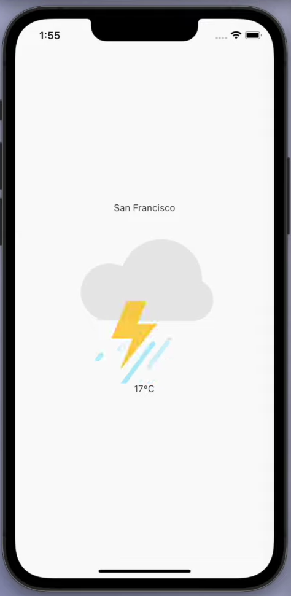

# Weather App 🌦️

A simple yet visually appealing Flutter weather app that provides real-time weather updates with animations using the Lottie library. The app fetches weather data from [OpenWeather](https://openweathermap.org/) and includes location-based weather retrieval.

## Features 🚀
- 📍 Fetches weather data based on user's current location
- 🌤️ Beautiful Lottie animations for different weather conditions
- 🔄 Loading animations while fetching data
- 📡 API integration with OpenWeather
- 📌 Displays city name, weather condition, and temperature
- 🧭 Uses `geolocator` and `geocoding` to determine location
- 🛠 Built with Flutter and Provider for state management

## Screenshots 📸

This is a dummy screenshot

## Dependencies 📦
```yaml
  cupertino_icons: ^1.0.2
  http: ^1.1.0
  geolocator: ^10.1.0
  geocoding: ^2.1.1
  lottie: ^2.7.0
  awesome_extensions: ^2.0.17
  provider: ^6.1.2
```

## Installation 🛠
1. Clone this repository:
   ```sh
   git clone https://github.com/iRahulGaur/weather_app_flutter.git
   ```
2. Navigate to the project directory:
   ```sh
   cd weather_app_flutter
   ```
3. Install dependencies:
   ```sh
   flutter pub get
   ```
4. Run the app:
   ```sh
   flutter run
   ```

## API Setup 🔑
1. Sign up on [OpenWeather](https://openweathermap.org/) and get an API key.
2. Add the API key in your project where necessary.

## Contributions 🤝
Feel free to fork and contribute to this project by creating a pull request.

## License 📄
This project is open-source and available under the MIT License.

---
🌟 Don't forget to give the repository a star if you found it useful! 😊
